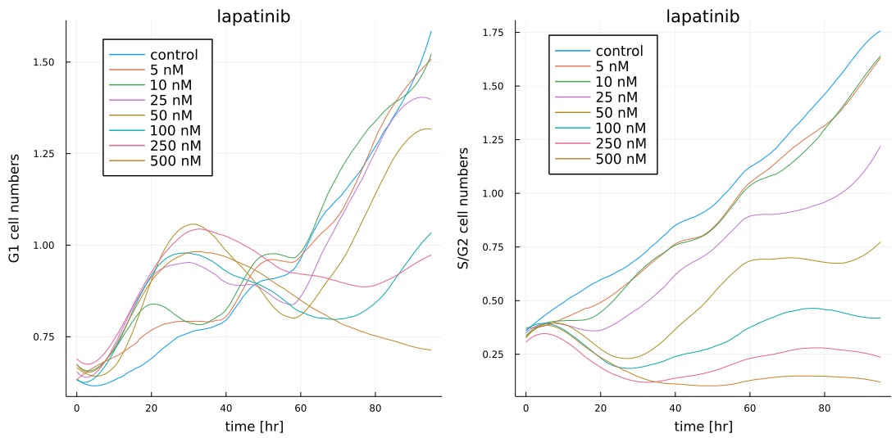

**Overview** - A guide to the Drug Response Model
=================================================

We present a system of ordinary differential equations to model the dynamics of cell cycle phase progression and cell death upon drug treatment. The data we used is a triplicate time-series of cells numbers at G1 and S/G2 cell cycle phases, recorded every 30 minutes. The overarching goal of implementing this model is to investigate the effects of various drugs in these two cell cycle phases in terms of cell death and cell arrest, and use them to calculate the effects of drug combination.

We used "Linear Chain Trick", a mathematical trick to derive the mean field ordianry differential equations directly. According to the G1 and S/G2 cell cycle phase lengths distributions that follow gamma, and the linear chain trick, we divided G1 into 8 and S/G2 into 20 subphases to account for the delay times we observed in the experimental data of cell numbers in these two phases. On top of that, each phase is divided into four parts to account for non-uniform effect of the drugs over a phase. Hence, each phase would have 4 phase progression parameters and 4 cell death parameters, and in total, we have 28 linear ODEs describing the system. Cell cycle phase progression and cell death have been considered to follow a Hill function over the range of concentrations. The progression rates are assumed to be strictly decreasing with more concentration and the cell death is assumed to be increasing with more concentration. Fitting the data of cell numbers to the ODE system, we used a BlackBoxOptim optimizer of the cost function to infer the aformentioned rates. To calculate the drug combination, we used Bliss additivity framework.

The functions for importing the data, pre-processing, fitting, optimization, and visualization are in the src folder. The following explains the content of each file in this folder.

`importData.jl` includes functions to import the single-drug treatment data as well as the drug combination data. The data is in the form of %G1 and normalized total cell numbers over time, and we convert this information into cell numbers in G1 and S/G2 phases, assuming the experiment started with one cell. This helps to keep the data in a normalized form. This files also includes the `savitzky_golay` filter that we used for smoothing the data.
The data is in the shape of [189 x 8 x 5] that 189 refers to the data points for 8 concentrations, and 5 refers to each drug with lapatinib being 1, doxorubicin 2, gemcitabine 3, paclitaxel 4, and palbociclib 5.

`ExpODE.jl` includes the cost function and the jacobian matrix of the system, assuming we only have one G1 and one S/G2 phase, without breaking it down into further subphases. This will assume the exponential growth of cells that we used as a baseline model.

`Hill.jl` contains the cost function and fitting functions assuming we want to fit the model to the data of 8 concentrations of one drug treatment.

`AllDrugs.jl` includes functions that let us fit all the data from 5 drugs we have at once. We fit them simultaneously to share some of the parameter between the drugs, such as the effect of the control condition.

`combination.jl` contains functions that calculate the Bliss additivity between the drugs in two ways: 1. using only the cell numbers from the experimental data, as a baseline model, 2. using the model inferred parameters.

`sensitivity.jl` includes functions regarding sensitivity of the parameters.


## 1. Loading and plotting the experimental data
------------------------------------------------

```
# load
concs, popul1, g1s1, g2s1 = load(189, 1)
_, popul2, g1s2, g2s2 = load(189, 2)
_, popul3, g1s3, g2s3 = load(189, 3)

# find the average of the three replicates
g1S = cat(g1s1, g1s2, g1s3, dims = 4)
g2S = cat(g2s1, g2s2, g2s3, dims = 4)
g1m = mean(g1S, dims = 4) # mean G1
g2m = mean(g2S, dims = 4) # mean G2

time = LinRange(0.0, 95.0, 189)
p1 = plot(time, g1m[:, :, 1], labels=["control" "5 nM" "10 nM" "25 nM" "50 nM" "100 nM" "250 nM" "500 nM"], title="lapatinib", ylabel="G1 cell numbers", xlabel="time [hr]")
p2 = plot(time, g2m[:, :, 1], labels=["control" "5 nM" "10 nM" "25 nM" "50 nM" "100 nM" "250 nM" "500 nM"], title="lapatinib", ylabel="S/G2 cell numbers", xlabel="time [hr]")
plot(p1, p2)
```



## 2. Run the fitting for one dataset, for example, lapatinib.
--------------------------------------------------------------

```
cost, p_hill = optimize_hill(concs[:, 1], g1m[:, :, 1], g2m[:, :, 1])
# converting the Hill parameters to ODE parameters
p_ode = getODEparams(p_hill, concs[:, 1])
```


## 3. Run the fitting for all drugs at once
-------------------------------------------

```
cost2, pAll_hill = optim_all(concs, g1m, g2m)
pAll_ode = getODEparams(pAll_hill, concs)
```


## 4. Calculate the combination parameters and the cell numbers
---------------------------------------------------------------

```
# lapatinib + gemcitabine: combination on model parameters
lap_gem_params = AllBliss_params(pAll_ode[:, :, 1], pAll_ode[:, :, 3])
G1 = zeros(189, 8, 8) # model prediction of cell numbers for all 8 concentrations of both.
G2 = zeros(189, 8, 8)
for i = 1:8
    for j = 1:8
        G1[:, i, j], G2[:, i, j], _ = predict(lap_gem_params[:, i, j], lap_gem_params[:, 1, 1], time)
    end
end
total_combination_model = G1 + G2

# lapatinib + gemcitabine:
total_cellnum_baseline = DrugResponseModel.pair_cellnum_Bliss(g1m[:, :, 1] .+ g2m[:, :, 1], g1m[:, :, 3] .+ g2m[:, :, 3])
```